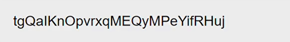

# react-decode-animation

> Decode effect typing animation for React.

[](https://www.npmjs.com/package/react-decode-animation) [](https://standardjs.com)



## Install

```bash
npm install react-decode-animation
```

## Usage
```jsx
import React, { useRef } from 'react'
import DecodeAnimation from 'react-decode-animation'

function App() {
  const ref = useRef(null)
  return (
    <div>
      <DecodeAnimation
        ref={ref}
        autoplay // will play when rendered
        text={"This is an animation Example"}
      />
      <div>
        <button onClick={() => ref.current?.play()}>Play</button>
        <button onClick={() => ref.current?.pause()}>Pause</button>
        <button onClick={() => ref.current?.reset()}>Reset</button>
      </div>
    </div>
  )
}
```

## Props
| Name | Description | Type | Default |
| ----------- | ----------- | ----------- | ----------- |
| `text`| The text that will be animated | `string` | - |
| `allowedCharacters` | A list of character types for the encoded text to use, this will not work if customCharacters is in use. [see Choosing Characters](#choosing-characters)  | `AllowedCharatersList` | `['uppercase', 'lowercase', 'numbers']` |
| `customCharacters` | Custom characters for the encoded text to use, this will override allowedCharacters. [see Displaying Any Characters](#displaying-any-characters) | `string` | - |
| `autoplay` | If True, DecodeAnimation will play once it is rendered | `boolean` | `false` |
| `onFinish` | onFinish is triggered when the decode animation is finished | `Function` | - |
| `interval` | The duration of each character reveal (in Milliseconds) [see interval](#interval) | `number` | 100 |
| `characterOptions` | Options for each characters [see characteroptions](#characteroptions) | `DecodeAnimationCharacterOptions` | - |
| `state` | Changing the state will `start | pause | reset` the animation. This prop is not recommended, use `useRef()` instead. [see Animate Programatically](#animate-programatically) | `'start' | 'pause' | 'reset'` | - |
| `ref` | A React ref that contains functions for playing, pausing and reseting the animation, ***recommended***. [see Animate Programatically](#animate-programatically) | `React.Ref<DecodeAnimationRef>` | - |

## How To Use It

### Get Started
To get started, install the library.
```bash
npm install react-decode-animation
```
First, import react-decode-animation to your file.
```jsx
import DecodeAnimation from 'react-decode-animation'
```
Next, call `DecodeAnimation` and pass a string to `text`, we can also pass in `autoplay` if we want it to play once it renders.
```jsx
<DecodeAnimation
  text={"Hello"} // required
  autoplay // This is optional, will play when rendered
/>
```

### Animate Programatically
Sometime, we don't want the animation to play automatically, we want it to play when it's called. We can animate it by using a `useRef()` hook. 

`DecodeAnimationRef` provides 3 functions, `play()` `pause()` `reset()`.
| Function | Description |
| ----------- | ----------- |
| `play()` | Plays the animation. |
| `pause()` | Pauses the animation when playing. |
| `reset()` | Resets and pauses the animation. |
```jsx
import React, { useRef } from 'react'
import DecodeAnimation from 'react-decode-animation'

function App() {
  // If you're using TypeScript --> useRef<DecodeAnimationRef>(null) <-- remember to import
  const ref = useRef(null) 
  return (
    <div>
      <DecodeAnimation
        ref={ref}
        text={"Animating by calling ref."}
      />
      <div>
        <button onClick={() => ref.current?.play()}>Play</button>
        <button onClick={() => ref.current?.pause()}>Pause</button>
        <button onClick={() => ref.current?.reset()}>Reset</button>
      </div>
    </div>
  )
}
```
> :warning: **There is another way to animate**: Be very careful!
Alternatively, we can animate it via states. Although not recommended(setting the same state will not work), it looks neat if you are just changing it once or twice.
```jsx
import React, { useState } from 'react'
import DecodeAnimation from 'react-decode-animation'

function App() {
  // If you're using TypeScript --> useState<DecodeState>("Paused") <-- remember to import
  const [decodeState, setDecodeState] = useState("Paused")
  return (
    <div>
      <DecodeAnimation
        state={decodeState}
        text={"Animating by setting state."}
      />
      <div>
        <button onClick={() => setDecodeState("Playing")}>Play</button>
        <button onClick={() => setDecodeState("Paused")}>Pause</button>
        <button onClick={() => setDecodeState("Reset")}>Reset</button>
      </div>
    </div>
  )
}
```

### Choosing Characters (`AllowedCharatersList`)
By default, `DecodeAnimation` provides some basic character sets to work with. If you want to have a custom set of characters go [see `customCharacters`](#displaying-any-characters).
| Sets | Description | Used by Default |
| ----------- | ----------- | ----------- |
| `uppercase` | QWERTYUIOPASDFGHJKLZXCVBNM | Yes |
| `lowercase` | qwertyuiopasdfghjklzxcvbnm | Yes |
| `numbers` | 1234567890 | Yes |
| `symbols` | `~!@#$%^&*()-_=+{}[];:'"\|\\<>,.?/ | No |

You can choose what goes to your `DecodeAnimation` by specifying it on `allowedCharacters`.
```jsx
// If you are only using one set 
<DecodeAnimation
  text={"This text has numbers."}
  allowedCharacters="numbers"
/>

// If you are using multiple sets
<DecodeAnimation
  text={"This text has numbers and symbols."}
  allowedCharacters={["numbers", "symbols"]}
/>
```


### Displaying Any Characters
```jsx
<DecodeAnimation
  text={"This Text is encoded with greek alphabets."}
  customCharacters="ΑΒΓΔΕΖΗΘΙΛΜΝΞΟΠΡΣΤΥΦΧΨΩαβγδεζηθικλμνξοπρστυφχψω" // looks AWESOME
/>
// output: θαυνπΨοΙΧσγιολΣΨσιξηβθλΡζΓυΞΧγθηεΓαμΥυΙΜΔζ
```
You can input a custom set of characters if the provided `allowedCharacters` is not what you need. In this example, we can use some greek alphabets to generate the code. We don't have to worry about duplicated characters `DecodeAnimation` will remove it automatically.

### Animation Duration
There are 2 intervals that we can set. 
#### `interval`
`interval` is the duration of each character reveal (in Milliseconds). if `inverval={1000}`, `DecodeAnimation` will reveal a character every 1 second.
```jsx
<DecodeAnimation
  text={"This Text is encoded with greek alphabets."}
  interval={100} // reveals a character every 100ms
/>
```
#### `characterOptions`
It is for the duration of each character looping speed. By default, `characterOptions={{ intervalDeviation: 10, interval: 100 }}`. `characterOptions.interval` is the base interval, and `characterOptions.intervalDeviation` is the milliseconds that the interval can deviate from.
```jsx
// Example
<DecodeAnimation
  text={"This Text is encoded with greek alphabets."}
  characterOptions={{ intervalDeviation: 50, interval: 150 }}
/>
// the interval of each character is ranged from 100 - 200
```

## License

[MIT](LICENCE) © [MrGGTo](https://github.com/MrGGTo)
